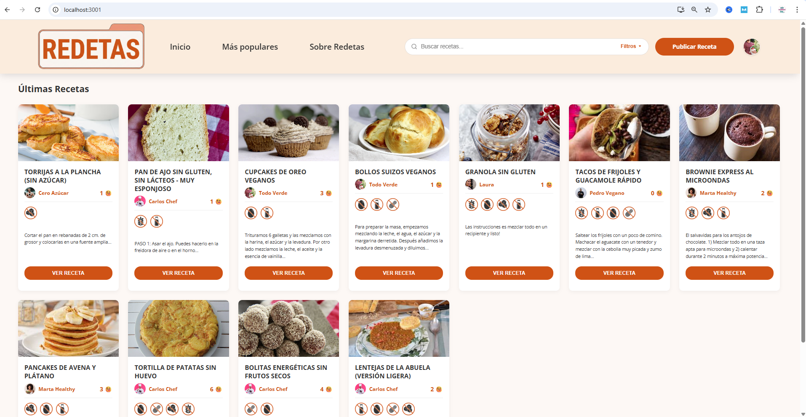
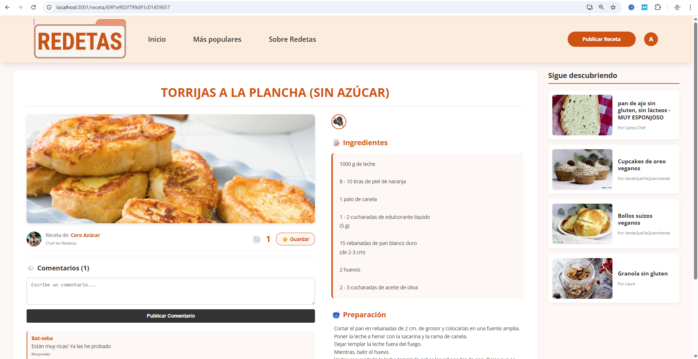
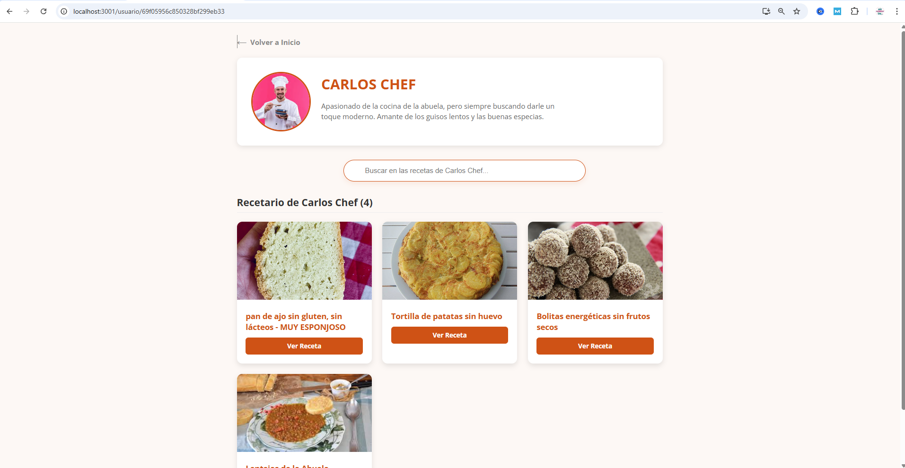

# REDETAS 

<div align="center">
  
  
  
  
</div>

> **UNA RED SOCIAL INCLUSIVA PARA DIETAS ESPECIALIZADAS**
> *Proyecto desarrollado como Trabajo de Fin de Grado / Proyecto Intermodular - Desarrollo de Aplicaciones Web.*

## SOBRE EL PROYECTO

**REDETAS** es una plataforma web (Single Page Application) diseñada para facilitar la vida a personas con necesidades dietéticas especiales (celiaquía, alergias, intolerancias, etc.). 

El objetivo principal es crear una comunidad culinaria (red social) segura e inclusiva donde los usuarios puedan compartir, buscar y guardar recetas, teniendo la absoluta certeza de que los filtros de alérgenos (sin gluten, sin huevo, sin lactosa, etc.) se aplican de forma precisa, visual e intuitiva.

---

## FUNCIONALIDADES PRINCIPALES

El proyecto va más allá de un CRUD tradicional, incorporando lógicas de interacción social y gestión de archivos multimedia:

- 🔐 **Sistema de Usuarios y Autenticación:** Registro, inicio de sesión y gestión de perfiles privados con personalización de avatar y biografía.
- 🍲 **Gestión Completa de Recetas (CRUD):** 
  - Creación de publicaciones con subida de imágenes y categorización estricta de alérgenos.
  - Edición *inline* (en tiempo real) sin necesidad de abandonar el panel de control.
  - Eliminación segura con validación mediante alertas nativas.
- 💬 **Interacción Social:** Sistema de *likes* ("Yummys") con animaciones, y un motor de comentarios con soporte para hilos de respuestas.
- ⭐ **Recetario Personal:** Funcionalidad para guardar recetas favoritas y consultarlas rápidamente mediante un buscador interno.
- 🏆 **Ranking Dinámico:** Salón de la fama actualizado en tiempo real con las recetas más valoradas por la comunidad.
- 🛡️ **Panel de Administración:** Panel de control de acceso restringido para la moderación del contenido.
- 📱 **Diseño Responsive:** Interfaz adaptada a todos los dispositivos móviles, priorizando la UX/UI mediante Flexbox y CSS Grid.

---

## VISTAS DE LA APLICACIÓN

<div align="center">
  
  
  
</div>

---

## TECNOLOGÍAS UTILIZADAS (MERN Stack)

El proyecto está construido bajo una arquitectura Cliente-Servidor (API REST), completamente desacoplada:

### **Frontend (Capa de Presentación)**
- **React.js** (Hooks, Context, Functional Components)
- **React Router DOM** (Enrutamiento dinámico SPA)
- **Axios** (Cliente HTTP para el consumo de la API)
- **CSS3 Puro** (Variables CSS, Flexbox, CSS Grid)
- **SweetAlert2** (Gestión de modales y alertas UI)

### **Backend (Capa Lógica y API)**
- **Node.js** & **Express.js** (Servidor y enrutamiento)
- **Multer** (Gestión de subida de archivos/imágenes - *Multipart/form-data*)
- **CORS** & **Dotenv** (Seguridad y variables de entorno)

### **Base de Datos (Capa de Persistencia)**
- **MongoDB** (Base de datos NoSQL)
- **Mongoose** (Modelado de objetos y esquemas de validación)

---

## INSTALACIÓN Y DESPLIEGUE LOCAL

Para ejecutar este proyecto en tu entorno local, asegúrate de tener instalados [Node.js](https://nodejs.org/) y [MongoDB](https://www.mongodb.com/).

### 1. Clonar el repositorio
\`\`\`bash
git clone https://github.com/Bat-seba/redetas.git
cd redetas
\`\`\`

### 2. Configurar y arrancar el Backend
Abre una terminal y colócate en la carpeta del servidor:
\`\`\`bash
cd backend
npm install
\`\`\`
*Crea un archivo `.env` en la raíz de la carpeta `backend` e incluye tus credenciales de configuración:*
\`\`\`env
PORT=3000
MONGO_URI=mongodb://localhost:27017/redetas_db
\`\`\`
*Inicia el servidor:*
\`\`\`bash
npm start
\`\`\`

### 3. Configurar y arrancar el Frontend
Abre una **nueva** ventana de terminal, colócate en la carpeta del cliente y ejecuta:
\`\`\`bash
cd frontend
npm install
npm start
\`\`\`
*La aplicación se abrirá automáticamente en tu navegador en `http://localhost:3001` (o el puerto configurado).*

---

## ESTRUCTURA DEL PROYECTO
```text
REDETAS/
├── backend/                  # Servidor Express y API REST
│   ├── controllers/          # Lógica de negocio (Recetas, Usuarios)
│   ├── models/               # Esquemas de Mongoose
│   ├── routes/               # Endpoints de la API
│   ├── uploads/              # Almacenamiento local de imágenes
│   └── server.js             # Punto de entrada del servidor
│
└── frontend/                 # Aplicación SPA React
    ├── public/               # Assets estáticos
    └── src/
        ├── components/       # Componentes reutilizables de UI
        ├── pages/            # Vistas principales de enrutamiento
        ├── App.js            # Configuración de React Router
        └── index.js          # Punto de entrada de React

---

**Autora:** Bat-seba Rodríguez Moreno - [https://github.com/Bat-seba](https://github.com/Bat-seba)